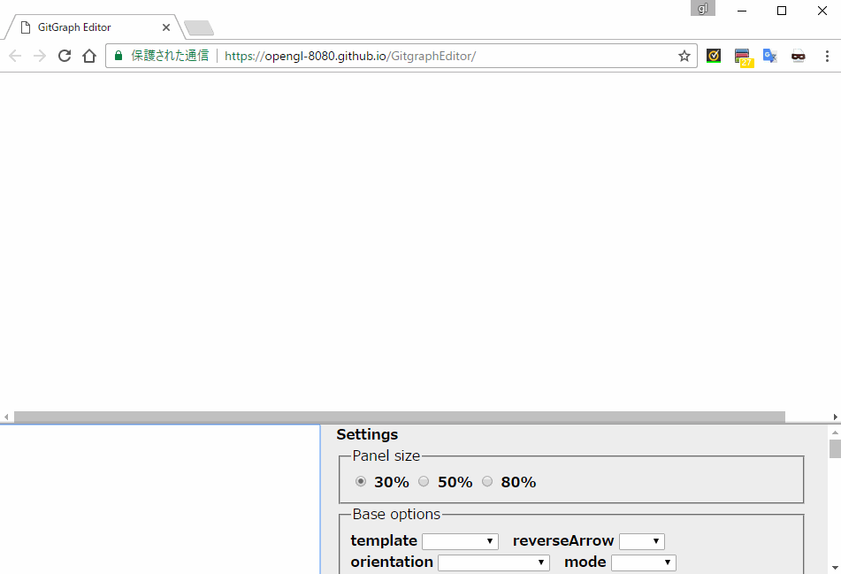
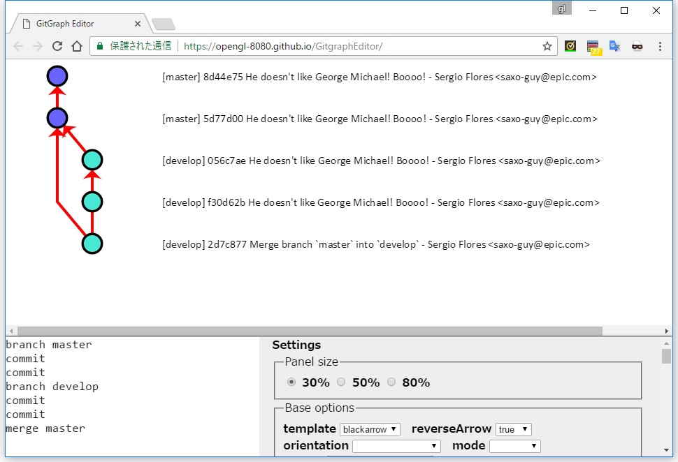
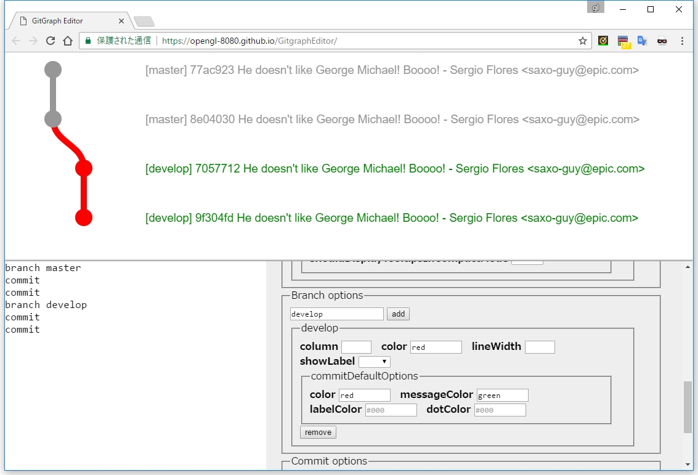
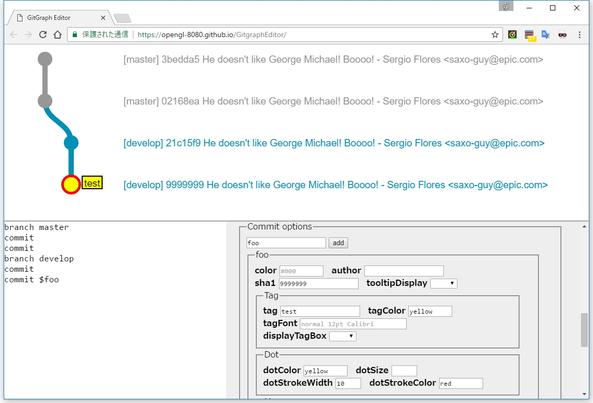

# GitgraphEditor
Editor for [Gitgraph.js](http://gitgraphjs.com/) on web blowser.



## What is this?
This is an editor for creating a Git flow diagram easily by [Gitgraph.js](http://gitgraphjs.com/).

This editor is worked on Web browser (Chrome, Firefox).

[Getting Started](https://opengl-8080.github.io/GitgraphEditor/)


## How to use


When you enter some commands into textarea at left bottom, a graph image is redraw immediately.

You can adjust Gitgraph configurations in the settings panel at right bottom.

### Branch Options


Define options each branches.

Please enter a branch name into textbox, and click `add` button.  
A new area to configure the branch is appended.

If you want to remove this options, please click `remove` button.

### Commit Options


Define options each commits.

First, you should enter commit command like following.

```
commit $commitName
```

An argument of commit command is `$<identityName>`.


Please enter `identityName` into textbox of "Commit options", and click `add` button.  
An new area to configure the commit is appended.

If you want to remove this options, please click `remove` button.

### Command
#### branch
```
branch <branchName> [startBranchName]
```

To create a new branch ('branchName') from HEAD.

You can specify start point branch through the `startBranchName`.

After branch creation, HEAD point new branch.

#### commit
```
commit [commitComment|$commitName]
```

To create a new commit.  
You can ommit arguments.


If you want enter a comment including some white spaces, please wrap comment by double quotation.

```
commit "white space message, \" - double quotation, \\ - back slash."
```

If you want to configure each commit options, you specify `$commitName`, and add "Commit options" at a Settings panel.

#### checkout
```
checkout <branchName>
```

To move HEAD to the branch(`branchName`).

#### merge
```
merge <branchName> [commitComment|$commitName]
```

To merge the branch(`branchName`) into HEAD.

#### tag
```
tag <tagName>
```

To create tag(`tagName`).

#### delete
```
delete <branchName>
```

To delete the branch(`branchName`).

#### orphanBranch
```
orphanBranch <branchName>
```

To create the orphan branch(`branchName`).

HEAD points the new branch.

#### ignore commands
- From `/*` to `*/` (multi line comment).
- Command is not exists.
- Required arguments are not set.
- Empty lines.

### Export/Import settings
All settings(including commands) are stored in local storage as json text.

You can export/import the settings using `export`/`import` buttons in the Settings panel.

**Sample settings**

```json
{"text":"branch master\ncommit\nbranch develop\ncommit\nbranch topic1\ncommit\ncommit\ncheckout develop\nmerge topic1\ncheckout master\nmerge develop $merge1\nbranch hotfix\ncommit\ncheckout master\nmerge hotfix $merge2\ncheckout develop\nmerge hotfix\n\ndelete topic1\nbranch topic2 develop\ncommit\n\n/*\ncommit\ncheckout develop\nmerge topic2\n*/\n\n","option":{"base":{"template":"blackarrow","orientation":"horizontal"},"template":{"arrow":{},"branch":{"showLabel":true,"labelFont":"normal 15pt monospace"},"commit":{"dot":{},"message":{}}},"branch":{"master":{"column":0,"commitDefaultOptions":{"color":"red"}},"develop":{"column":2,"commitDefaultOptions":{"color":"lightgray"}},"topic1":{"column":3,"commitDefaultOptions":{}}},"commit":{"merge1":{"tag":"v1.0","tagFont":"normal 15pt monospace"},"merge2":{"tag":"v1.1","tagFont":"normal 15pt monospace"}}}}
```

-----


## これはなに？
[Gitgraph.js](http://gitgraphjs.com/) を利用したフロー図を簡単に作成するためのエディターです。

ブラウザ上で動作します。

[こちら](https://opengl-8080.github.io/GitgraphEditor/) で実際に試すことができます。

## 使い方


左下のテキストエリアにコマンドを入力すると、リアルタイムでグラフが更新されます。

右下の設定パネルを操作することで、グラフの表示を調整することができます。

### Branch Options


ブランチごとの設定を定義します。

テキストボックスにブランチ名を入力して `add` ボタンをクリックしてください。  
ブランチを設定するための領域が追加されます。

不要になった場合は `remove` ボタンで削除してください。

### Commit Options


コミットごとの設定を定義します。

この設定を使うには、まず `commit` コマンドの引数を次のように記述します。

```
commit $commitName
```

引数を `$<識別名>` にします。

Commit options のテキストボックスには「識別名」で指定した文字列を入力し、 `add` ボタンをクリックしてください。  
コミットを設定するための領域が追加されます。

不要になった場合は `remove` ボタンで削除してください。

### コマンド
#### branch
```
branch <branchName> [startBranchName]
```

現在の HEAD から `branchName` ブランチを新規に作成します。

作成元のブランチを `startBranchName` で指定することもできます。

ブランチ作成後、 HEAD は新規作成されたブランチを指しています。

#### commit
```
commit [commitComment|$commitName]
```

コミットを作成します。  
引数は省略可能です。

`commitComment` に半角スペースが含まれる場合は、ダブルクォーテーションで括ってください。  
ダブルクォーテーションをそのまま出力したい場合は `\"` としてください。  
バックスラッシュをそのまま出力したい場合は `\\` としてください。

コミットごとに詳細な設定を指定したい場合は `$` 始まりの文字列を指定します。  
`commitName` を設定パネルの Commit options に追加することで、コミットを指定した詳細な設定が可能になります。

#### checkout
```
checkout <branchName>
```

HEAD を指定したブランチに移動させます。

#### merge
```
merge <branchName> [commitComment|$commitName]
```

現在の HEAD に指定したブランチをマージします。

#### tag
```
tag <tagName>
```

タグを作成します。

#### delete
```
delete <branchName>
```

指定したブランチを削除します。

#### orphanBranch
```
orphanBranch <branchName>
```

孤立ブランチを作成します。

HEAD は作成されたブランチに移動します。

#### 無視されるコマンド
次のいずれかの条件を満たす記述は無視されます。

- `/*` から `*/` までの記述（複数行コメント）
- 存在しないコマンドで始まる行
- 必須の引数が指定されていないコマンド
- 空行

### 設定のエクスポート・インポート
コマンドも含め、全ての設定はローカルストレージに JSON 形式の文字列で保存されています。

設定パネルの `Storage` → `export`, `import` ボタンをクリックすることで、その設定の出し入れが可能です。

**サンプル設定**

```json
{"text":"branch master\ncommit\nbranch develop\ncommit\nbranch topic1\ncommit\ncommit\ncheckout develop\nmerge topic1\ncheckout master\nmerge develop $merge1\nbranch hotfix\ncommit\ncheckout master\nmerge hotfix $merge2\ncheckout develop\nmerge hotfix\n\ndelete topic1\nbranch topic2 develop\ncommit\n\n/*\ncommit\ncheckout develop\nmerge topic2\n*/\n\n","option":{"base":{"template":"blackarrow","orientation":"horizontal"},"template":{"arrow":{},"branch":{"showLabel":true,"labelFont":"normal 15pt monospace"},"commit":{"dot":{},"message":{}}},"branch":{"master":{"column":0,"commitDefaultOptions":{"color":"red"}},"develop":{"column":2,"commitDefaultOptions":{"color":"lightgray"}},"topic1":{"column":3,"commitDefaultOptions":{}}},"commit":{"merge1":{"tag":"v1.0","tagFont":"normal 15pt monospace"},"merge2":{"tag":"v1.1","tagFont":"normal 15pt monospace"}}}}
```

## Release Note
### 英語
- v1.0.0 first release

### 日本語
- v1.0.0 初回リリース